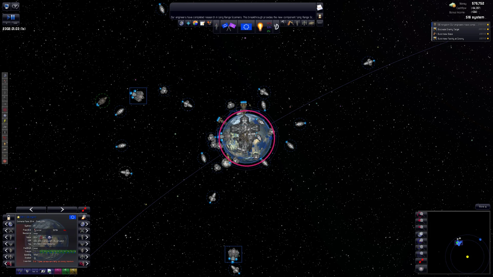
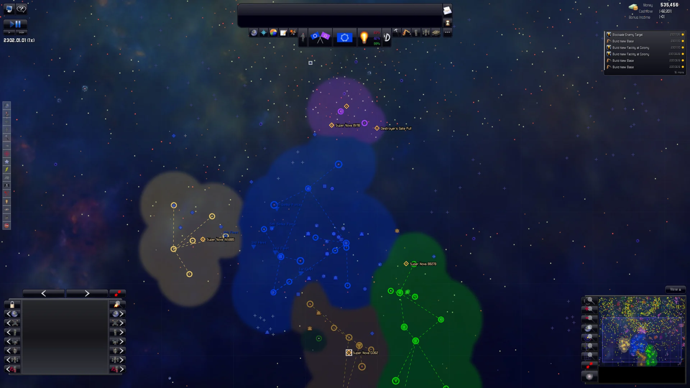
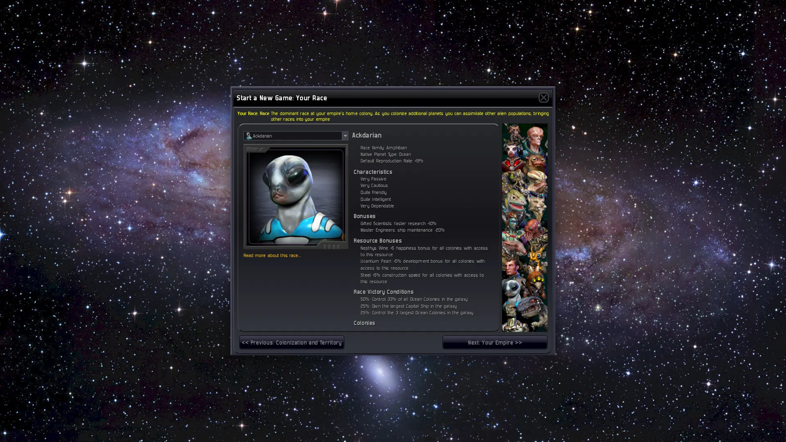
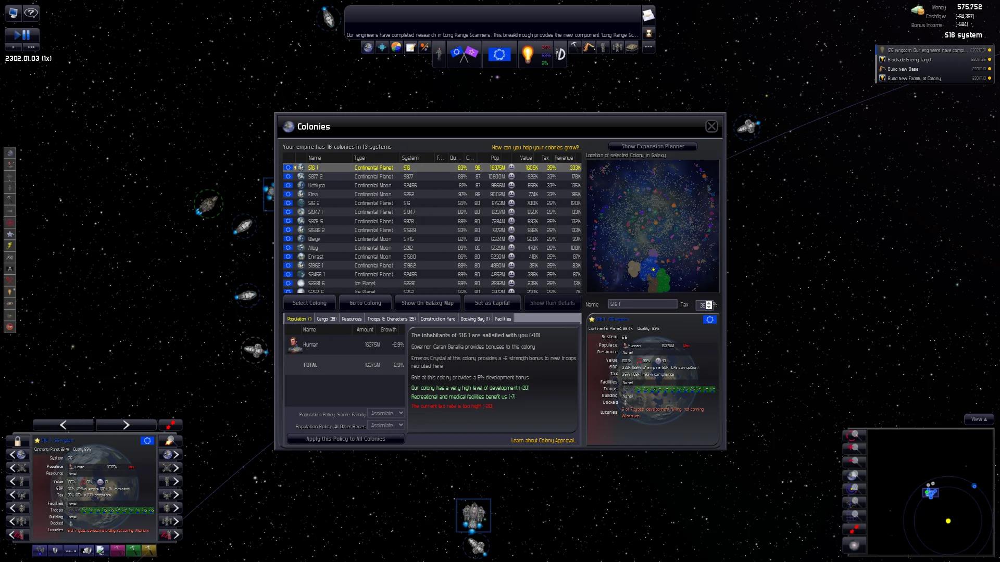
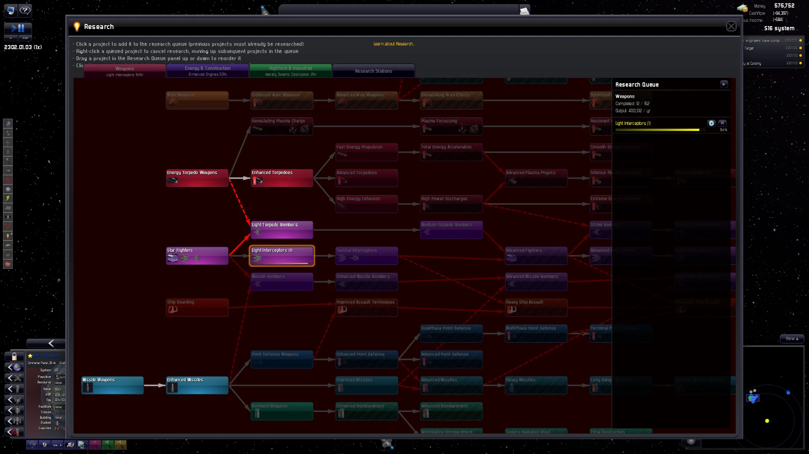

<div align="center">

# openDWU

**A faithful recreation of *Distant Worlds: Universe* (v1.9.5) in TypeScript and PixiJS.**

[](https://github.com/jfj-oss/openDWU/releases/latest)
[](#install)
[](LICENSE)



</div>

> [!IMPORTANT]
> **You need your own copy of the original game's data files.** This
> repository ships no original art, sounds, data or decompiled source; the
> game reads them at runtime from a Distant Worlds: Universe install folder,
> either your Steam install or a clone of the private `jfj-oss/dwu-assets`
> repo (only if you have been given access).

openDWU is ported directly from the game's decompiled engine source
(formulas, constants, generation order and RNG sequence), with an opt-in
mod/scenario layer on top. The code lives under [`game/`](game/).

## Why this exists

First off, I'm not an experienced game developer by any stretch of the
imagination. I'm a university student who's had an immovable love for this game.
And as the years passed I couldn't help but notice and watch the game slowly lose 
compatibility, every new Windows release and update further marking its gradual crawl 
to the grave. And as the years passed and the forums were filled up, at an ever
increasing rate, with posts about the game not launching I was terribly disheartened.

I worried that eventually it would become hard
enough to get running that it would fade to obscurity, left to a tiny niche
willing to jump through hoops just to get it working, until even they forgot.

In this same vein, in the process of rebuilding the game I thought it good to not only
have a native app for Windows but for Mac OS (arm) as well as for Linux, in the hope
of allowing as large of an audience as possible to have access to this gem.

And, while I was tinkering with the game I couldn't resist adding a few things from my 
own wishlist: much bigger galaxies (up to 90×90 sectors, 8,000 star systems and 100
empires), some new kinds of content (WORK-IN-PROGRESS), deeper changes to some of the 
game's systems (WIP) and some AI/UI/QOL improvements. Every one of them is optional and
can be switched off, so you can always play a completely authentic game of DW:U.

But of course, the elephant in the room, none of this would have been realistic for
one student without generative AI. It did most of the heavy lifting on the code, 
while I acted as its guinea pig steering, testing and playing. I hope you won't write 
this off as AI slop. I hope you can see the passion and good intentions behind it.

## What's here

- **A faithful port of DW:U 1.9.5**: the original engine's formulas,
  constants, order of operations and seeded `System.Random` sequence, with
  thousands of seed-pinned values to catch regressions.
- **One seamless map.** Scroll continuously from the whole galaxy down to a
  single planet and back. The galaxy and system views are the same map at
  different zoom levels, cross-fading instead of switching screens.
- **Desktop apps for macOS, Linux and Windows.** They find your Steam
  install, remember your game folder and offer new releases. You can also
  run the game from source in the browser.
- **Opt-in scenarios and mods.** With no scenario selected the game is the
  byte-identical port. Scenarios add factions, storylines and threats, each
  behind its own flags ([details](#scenarios-and-mods)).
- **Improvements inspired by Distant Worlds 2**: battle reports, supply-chain
  visibility, waypoints, a Fleet Settings panel, and resource, fuel-range and
  colony-score overlays. You can switch each one off in Game Options →
  Improvements.
- **Modded themes work out of the box.** Any theme in your install's
  `Customization` folder (Star Trek, Mass Effect, Warhammer 40,000, …) can
  be switched on from the main menu ([how](#themes-modded-content)).
- **Bacon mod settings per game.** Every game keeps its own
  `BaconSettings.txt` values, and you can edit them at any time from Game
  Options.
- **Deterministic and replayable.** A seed plus the player's command log
  reproduces a game exactly.

## Screenshots

<table>
  <tr>
    <td width="50%"></td>
    <td width="50%"></td>
  </tr>
  <tr>
    <td align="center"><sub>Zoomed out: empire territories over the nebulae</sub></td>
    <td align="center"><sub>New game wizard: choosing your race</sub></td>
  </tr>
  <tr>
    <td width="50%"></td>
    <td width="50%"></td>
  </tr>
  <tr>
    <td align="center"><sub>The Colonies window, over the map</sub></td>
    <td align="center"><sub>The research tree and queue</sub></td>
  </tr>
</table>

## Install

**Jump to your platform:** [Windows](#windows) · [macOS](#macos) · [Linux](#linux) · [Themes](#themes-modded-content) · [Troubleshooting](#troubleshooting) · [Tests](#tests) · [About the project](#about-the-project)

Each platform section starts with the **desktop app**: download it from the
[Releases page](https://github.com/jfj-oss/openDWU/releases), point it at
your game folder once, and play. The apps check for a new release once a day
and offer to download it. Below that, **running from source** (for
development, or to play the latest code in the browser) needs
**Node.js 22.12 or newer** (Node 24 LTS is fine) and **git**.

The apps are not code-signed (this is a free hobby project without Apple or
Microsoft certificates), so macOS and Windows warn about them the first time;
each section below says how to get past that once.

---

## Windows

<details>
<summary><b>Desktop app (Windows 10/11, 64-bit)</b></summary>

**1. Download** `openDWU-<version>-windows-x64-setup.exe` from the
[latest release](https://github.com/jfj-oss/openDWU/releases/latest). (There
is also a portable `openDWU-<version>-windows-x64.zip`: extract it anywhere
and run `dwu.exe`.) If your browser says the file "isn't commonly
downloaded", choose **Keep**.

**2. Run the installer.** The app is unsigned, so Windows SmartScreen shows
"Windows protected your PC": click **More info**, then **Run anyway**. The
installer needs no administrator rights: it installs for your user (by
default to `%LOCALAPPDATA%\Programs\dwu`) and adds **openDWU** to the Start
menu and the desktop.

**3. First launch.** openDWU looks for your Distant Worlds: Universe folder in
every Steam library (it reads Steam's location from the registry and the
other libraries, e.g. on `D:`, from Steam's `libraryfolders.vdf`), then in
`C:\Program Files (x86)\Steam\steamapps\common\Distant Worlds Universe`.
If it finds none, a setup window asks for the folder: click
**Choose Folder…** and pick the folder that contains `images` and
`races.txt` (in Steam: right-click the game → **Manage** → **Browse local
files** opens it). Picking the Steam library or `steamapps` folder above it
also works. The choice is remembered.

No Steam install, but access to the private assets repo? Clone it in
PowerShell with `git clone https://github.com/jfj-oss/dwu-assets.git
$HOME\dwu-assets`, then pick that `dwu-assets` folder in the setup window.
You don't need Node.js or npm for the app.

To use another folder later, press **Ctrl+Shift+O** in the game and choose
**Game Folder…** (the same menu has **Check for Updates…**).

**4. Updates.** When a new release is out, the app offers it at startup
(at most once a day): **Download** opens the new installer in your browser;
run it and it replaces the old version (settings and saves are kept).

**Uninstall:** Settings → Apps → **openDWU**. Your settings and saves stay in
`%APPDATA%\Distant Worlds Universe`; delete that folder too to remove them.

</details>

<details>
<summary><b>Run from source (browser)</b></summary>

**1. Install Node.js and git**

```powershell
winget install --id OpenJS.NodeJS.LTS -e
winget install --id Git.Git -e
```

Close and reopen PowerShell so `node` and `git` are on your PATH, then check:

```powershell
node -v    # must print v22.12 or newer
git --version
```

**2. Clone openDWU and install dependencies**

```powershell
cd $HOME
git clone https://github.com/jfj-oss/openDWU.git
cd openDWU\game
npm ci
```

**3. Link the game data**

`npm run import-assets` is a bash script and does **not** work on Windows.
Create a directory junction instead (no administrator rights or Developer
Mode needed). Run this from `openDWU\game`, changing the path if your Steam
library is somewhere else (e.g. `D:\SteamLibrary\steamapps\common\Distant Worlds Universe`):

```powershell
$DwuDir = "C:\Program Files (x86)\Steam\steamapps\common\Distant Worlds Universe"
New-Item -ItemType Directory -Force public\assets | Out-Null
New-Item -ItemType Junction -Path public\assets\dwu -Target $DwuDir
```

The folder must contain an `images` subfolder. Nothing is copied; the
junction just points at your install. If you use the private assets repo
instead of Steam, clone it and point the junction at the clone:

```powershell
git clone https://github.com/jfj-oss/dwu-assets.git $HOME\dwu-assets
New-Item -ItemType Directory -Force public\assets | Out-Null
New-Item -ItemType Junction -Path public\assets\dwu -Target $HOME\dwu-assets
```

**4. Run the game**

```powershell
npm run dev
```

Open the URL it prints (normally <http://localhost:5173/>) in your browser.
Windows Firewall may ask about Node.js because the dev server also listens
on your local network; allowing "Private networks" is enough. Stop the
server with `Ctrl+C`.

**5. Optional: build the desktop app yourself**

```powershell
npm run package:win    # -> release\dwu-win32-x64\dwu.exe
npm run dist:win       # also the installer and zip in release\upload\
```

**6. Update to the latest version**

From `openDWU\game`, with the dev server stopped:

```powershell
git pull
npm ci
npm run dev
```

The junction from step 3 is kept across updates. If you use the assets
repo, also run `git -C $HOME\dwu-assets pull`.

</details>

---

## macOS

<details>
<summary><b>Desktop app (Apple silicon: M1 and later)</b></summary>

**1. Download** `openDWU-<version>-macos-arm64.dmg` from the
[latest release](https://github.com/jfj-oss/openDWU/releases/latest), open
it and drag **dwu** onto **Applications**. (Intel Macs: there is no Intel
build; run from source in the browser below.)

**2. First launch (once).** The app is not signed with an Apple Developer ID,
so a plain double-click is refused ("dwu can't be opened" / "Apple could not
verify…"). Open it once like this:

- In **Applications**, **Control-click** (or right-click) **dwu** → **Open** →
  **Open**.
- On macOS 15 Sequoia and later, if there is no Open button: double-click
  **dwu** once, then open **System Settings → Privacy & Security**, scroll to
  the message about "dwu", click **Open Anyway** and confirm.
- Or in Terminal: `xattr -dr com.apple.quarantine /Applications/dwu.app`

After that it opens normally (also after updates installed the same way).

**3. Game files.** Distant Worlds: Universe is a Windows game, so a Mac has no
native install; openDWU only needs its files, not a working Windows game. On
first launch a setup window asks for the folder and explains the options:

- **Steam for Windows inside [Whisky](https://getwhisky.app/) or
  [CrossOver](https://www.codeweavers.com/crossover):** install DW:U there;
  openDWU finds it inside the bottle automatically
  (`…/drive_c/Program Files (x86)/Steam/steamapps/common/Distant Worlds Universe`).
- **A copy from a Windows PC:** copy the whole `Distant Worlds Universe`
  folder (Steam → right-click the game → Manage → Browse local files) to
  `~/Games/Distant Worlds Universe`, which is also found automatically, or
  anywhere else and pick it with **Choose Folder…**.
- **The private assets repo** (if you have access): clone it in Terminal
  with `git clone https://github.com/jfj-oss/dwu-assets.git ~/dwu-assets`,
  then pick the `dwu-assets` folder in your home folder. You don't need
  Node.js or npm for the app.

To use another folder later: **Distant Worlds Universe** menu → **Game
Folder…** (next to **Check for Updates…**).

**4. Updates.** When a new release is out, the app offers it at startup (at
most once a day): **Download** opens the new disk image in your browser;
drag **dwu** to Applications again, replacing the old one, and repeat the
one-time step 2. Settings and saves are kept.

</details>

<details>
<summary><b>Run from source (browser)</b></summary>

**1. Install Node.js and git**

Install [Homebrew](https://brew.sh) if you don't have it:

```sh
/bin/bash -c "$(curl -fsSL https://raw.githubusercontent.com/Homebrew/install/HEAD/install.sh)"
```

On Apple Silicon (M1 and later), Homebrew installs to `/opt/homebrew`; if
`brew` is "command not found" afterwards, run the two `echo`/`eval` lines
the installer prints under "Next steps", or:

```sh
eval "$(/opt/homebrew/bin/brew shellenv)"
```

Then:

```sh
brew install node git
node -v    # must print v22.12 or newer
```

**2. Get the game data**

There is no native macOS version of Distant Worlds: Universe, so use one of:

- **The private assets repo** (if you have access; git asks for your GitHub
  credentials):

  ```sh
  git clone https://github.com/jfj-oss/dwu-assets.git ~/dwu-assets
  ```

- **A copy of a Windows or Linux install:** copy the whole
  `Distant Worlds Universe` folder (the one containing `images/`) to
  `~/Games/Distant Worlds Universe`.

**3. Clone openDWU, install dependencies and link the data**

```sh
cd ~
git clone https://github.com/jfj-oss/openDWU.git
cd openDWU/game
npm ci
```

`import-assets` has no macOS default path, so always pass `DWU_DIR`.
Use the line that matches step 2:

```sh
DWU_DIR="$HOME/dwu-assets" npm run import-assets
```

```sh
DWU_DIR="$HOME/Games/Distant Worlds Universe" npm run import-assets
```

It prints `linked ... -> public/assets/dwu` (a symlink; nothing is copied).

**4. Run the game**

```sh
npm run dev
```

Open the URL it prints (normally <http://localhost:5173/>). Stop it with `Ctrl+C`.

**5. Optional: build the desktop app yourself (Apple silicon)**

```sh
npm run package:mac    # -> release/dwu-darwin-arm64/dwu.app (signed ad hoc when built on the Mac)
npm run dist:mac       # also the disk image in release/upload/
open release/dwu-darwin-arm64/dwu.app
```

See [`game/desktop/README.md`](game/desktop/README.md) for details, e.g.
building the Mac app on Linux and re-signing it on the Mac.

**6. Update to the latest version**

From `~/openDWU/game`, with the dev server stopped:

```sh
git pull
npm ci
npm run dev
```

If you use the assets repo, also run `git -C ~/dwu-assets pull`.

</details>

---

## Linux

<details>
<summary><b>Desktop app (x86_64)</b></summary>

**1. Download** from the
[latest release](https://github.com/jfj-oss/openDWU/releases/latest) either

- `openDWU-<version>-linux-x64.AppImage`: one file; make it executable and
  run it from the folder you downloaded it to:

  ```bash
  cd ~/Downloads
  chmod +x openDWU-*-linux-x64.AppImage
  ./openDWU-*-linux-x64.AppImage
  ```

  AppImages need FUSE 2: if it does not start, install it
  (Ubuntu 24.04: `sudo apt install libfuse2t64`; Ubuntu 22.04 / Debian:
  `libfuse2`; Fedora: `fuse-libs`; Arch: `fuse2`), or run it with
  `--appimage-extract-and-run`.

- or `openDWU-<version>-linux-x64.tar.gz`: extract it anywhere and run
  `openDWU-<version>-linux-x64/dwu`.

**2. First launch.** openDWU looks for the game in every Steam library it can
find (`~/.local/share/Steam`, `~/.steam/steam`, Flatpak and Snap Steam, and
the extra libraries listed in Steam's `libraryfolders.vdf`), plus
`~/Games/Distant Worlds Universe`. If it finds none, a setup window asks for
the folder: click **Choose Folder…** and pick the folder containing
`images` and `races.txt` (in Steam: right-click the game → Manage → Browse
local files), or paste its path. The choice is remembered.

No Steam install, but access to the private assets repo? Clone it with
`git clone https://github.com/jfj-oss/dwu-assets.git ~/dwu-assets`, then pick
`~/dwu-assets` in the setup window. You don't need Node.js or npm for the
app.

To use another folder later, press **Ctrl+Shift+O** in the game and choose
**Game Folder…** (the same menu has **Check for Updates…**).

**3. Updates.** When a new release is out, the app offers it at startup (at
most once a day): **Download** opens the new AppImage (or tar.gz) in your
browser; replace the old file with it. Settings and saves
(`~/.config/Distant Worlds Universe`) are kept.

</details>

<details>
<summary><b>Run from source (browser)</b></summary>

**1. Install Node.js and git**

Arch / CachyOS / Manjaro:

```bash
sudo pacman -S --needed nodejs npm git
```

Debian / Ubuntu (the distro's Node is usually too old; this uses NodeSource's Node 22):

```bash
curl -fsSL https://deb.nodesource.com/setup_22.x | sudo -E bash -
sudo apt-get install -y nodejs git
```

Fedora:

```bash
sudo dnf install nodejs npm git
```

Check the version:

```bash
node -v    # must print v22.12 or newer
```

**2. Get the game data**

If DW:U is installed through Steam at the default location,
`~/.local/share/Steam/steamapps/common/Distant Worlds Universe`, there is
nothing to do here. Otherwise note where your copy is (another Steam
library, Flatpak Steam at
`~/.var/app/com.valvesoftware.Steam/.local/share/Steam/steamapps/common/Distant Worlds Universe`),
or clone the private assets repo if you have access:

```bash
git clone https://github.com/jfj-oss/dwu-assets.git ~/dwu-assets
```

**3. Clone openDWU, install dependencies and link the data**

```bash
cd ~
git clone https://github.com/jfj-oss/openDWU.git
cd openDWU/game
npm ci
```

Default Steam location:

```bash
npm run import-assets
```

Anywhere else (e.g. the assets repo):

```bash
DWU_DIR="$HOME/dwu-assets" npm run import-assets
```

It prints `linked ... -> public/assets/dwu` (a symlink; nothing is copied).

**4. Run the game**

```bash
npm run dev
```

Open the URL it prints (normally <http://localhost:5173/>). Stop it with `Ctrl+C`.

**5. Optional: build the desktop app yourself (x86_64)**

```bash
npm run package:linux   # -> release/dwu-linux-x64/dwu
npm run dist:linux      # also the AppImage and tar.gz in release/upload/
release/dwu-linux-x64/dwu
```

The Windows app (`npm run package:win` / `dist:win`) also builds on Linux;
the Mac app (`npm run package:mac`) too, but it must be re-signed on the Mac,
see [`game/desktop/README.md`](game/desktop/README.md).

**6. Update to the latest version**

From `~/openDWU/game`, with the dev server stopped:

```bash
git pull
npm ci
npm run dev
```

If you use the assets repo, also run `git -C ~/dwu-assets pull`.

</details>

---

## Themes (modded content)

Themes made for the original game, also called customization sets, work in
openDWU unchanged. A theme can replace races, empire policies, ship designs
and names, and the game's art, sounds and music.

<details>
<summary><b>How to install and switch themes</b></summary>

1. **Put the theme in your install's `Customization` folder.** That is the
   folder of the Distant Worlds: Universe install openDWU uses: in Steam,
   right-click the game → **Manage** → **Browse local files** → `Customization`.
   It already holds the themes that ship with the game, such as
   `Distant Worlds Original`. A theme is one folder inside it, for example
   `Customization/Mass Effect 4 Mod/`. If a download unpacks to an extra
   folder level, move the theme folder up so that its `about.txt`, `images`
   and so on sit directly inside it.
2. **Switch to it in the game.** On the main menu, click **Change Theme**,
   pick the theme on the left (its description and picture show on the
   right) and click **Switch Theme**. The game reloads with the theme
   active and remembers it for next time.
3. **Back to the original:** **Change Theme** → **(Default)** → **Switch
   Theme**.

Notes:

- Files load the way the original loads them: each one comes from the theme
  when the theme has it, and from the base game otherwise. Partial themes
  (art only, music only) work too.
- Some themes include prebuilt galaxy maps (`maps/*.dwg`). Those can't be
  loaded yet; the rest of such a theme works.

</details>

---

## Troubleshooting

Desktop app:

- **macOS: "dwu can't be opened" / "is damaged" / "Apple could not verify".**
  The app is unsigned; do the one-time step 2 of [macOS](#macos). If it
  still says "damaged", run `xattr -dr com.apple.quarantine /Applications/dwu.app`.
- **Windows: "Windows protected your PC".** Click **More info** → **Run
  anyway** (unsigned app, see [Windows](#windows) step 2).
- **Linux: the AppImage does nothing / mentions `libfuse.so.2`.** Install FUSE
  2 (see [Linux](#linux) step 1) or use the tar.gz.
- **Linux tar.gz: "The SUID sandbox helper binary was found, but is not
  configured correctly".** Your distro restricts user namespaces (e.g. Ubuntu
  24.04). Start it as `./dwu --no-sandbox`, use the AppImage (which does this
  automatically when needed), or make the helper setuid:
  `sudo chown root:root chrome-sandbox && sudo chmod 4755 chrome-sandbox`.
- **Placeholder art in the desktop app / wrong game folder.** Open the game
  folder setting (macOS: app menu → **Game Folder…**; Windows/Linux:
  **Ctrl+Shift+O** → **Game Folder…**) and pick the folder with `images`
  and `races.txt`.
- **No update prompts.** The check runs at most once a day and only offers
  full releases (not pre-releases); use **Check for Updates…** in the same
  menu to check now. To turn the daily check off, add
  `"checkForUpdates": false` to `config.json` in the settings folder
  (Windows `%APPDATA%\Distant Worlds Universe`, macOS
  `~/Library/Application Support/Distant Worlds Universe`, Linux
  `~/.config/Distant Worlds Universe`).

From source:

- **Planets, ships and UI show plain generated placeholder art.** The game
  data isn't linked. Redo step 3 for your platform, then restart
  `npm run dev` (it regenerates `public/asset-manifest.json` from the linked
  folder on every start; the file list is not picked up while the server is
  running).
- **`DW:U install not found at ...`** (macOS/Linux). The path passed to
  `import-assets` has no `images/` folder. Check the path and its quoting.
  The script's default is the Linux Steam path, so macOS always needs `DWU_DIR`.
- **`New-Item : An item with the specified name ... already exists`** (Windows).
  Remove the old link first with `cmd /c rmdir public\assets\dwu` (this
  removes only the junction, not your game files), then rerun step 3.
- **`npm ci` reports `EBADENGINE`, or Vite/Vitest fail with syntax errors.**
  Your Node is too old; install Node 22.12 or newer and run `npm ci` again.
- **Port 5173 is already in use.** Vite picks the next free port
  (5174, ...) automatically; open the URL it prints.
- **`npm run import-assets` fails on Windows.** Expected; it is a bash
  script. Use the junction from the [Windows](#windows) step 3.
- **`npm run test:fast` / `test:slow` fail on Windows.** They set an
  environment variable with bash syntax; see [Tests](#tests).

## Tests

Run from `game/`:

```sh
npm run test:fast          # everything except the slow soak tests, for iterating
npm test                   # the full test suite
npm run repin -- --check   # verify the seed-pinned ("golden pin") values are still up to date
npm run typecheck
```

On Windows PowerShell, run the fast tier as
`$env:DWU_TEST_TIER = "fast"; npx vitest run` (and
`Remove-Item Env:DWU_TEST_TIER` afterwards); `npm test` works as is.

---

## About the project

- **Faithful port.** Game logic in `game/src/sim/` is ported line-for-line
  where practical from the original C# engine — same formulas, same order of
  operations, same seeded `System.Random` sequence — and cross-checked
  against the original data files (`races.txt`, `resources.txt`, `Policy/`,
  `designTemplates/`, …).
- **Deterministic simulation.** The sim is a headless model (no DOM/Pixi
  imports) that is fully determined by a seed plus the sequence of player
  commands: a saved seed and command log reproduce an identical game byte
  for byte, including under a real-time driver with irregular frames, pauses
  and skewed wall clocks (`game/test/commandReplay.test.ts`).
- **Golden pins.** Thousands of seed-dependent values (galaxy generation,
  empire stats, combat outcomes, …) are pinned against recorded output in
  `game/test/pins/seed1.json` and checked on every run; `npm run repin --
  --check` fails if anything would change, so a regression in the port shows
  up immediately.
- **Replay.** Because a game is just a seed plus a command log, any game can
  be replayed deterministically from scratch — the same mechanism the pin
  suite and the determinism tests use.
- **Opt-in mod/scenario layer.** With every scenario off, the game is the
  byte-identical faithful port. A scenario/data overlay adds new factions,
  storylines, systems and behaviour on top, each behind its own feature
  flags — see [Scenarios and mods](#scenarios-and-mods) below.

### Scenarios and mods

With no scenario selected the game is the unmodified, byte-identical
faithful port. Scenarios are chosen on the **Scenario** page of the new-game
wizard (between Victory Conditions and Start): pick "None" for the original
game, or a scenario from the list to see its description and a checkbox per
feature flag plus a number box per tunable parameter. Each scenario is a
data overlay (races/resources/policy/template additions and extra text)
plus code paths gated behind its flags; turning every flag off reproduces
the faithful game exactly, so scenario development never risks the base
port's pins.

Some of the shipped scenarios (see `game/scenarios/*/scenario.json` for the
full list, flags and parameters):

| Scenario | What it adds |
|---|---|
| Rim Frontier | An ion-storm belt, thinning stars, gravity shoals, scarce fuel and sensor fog make the outer rim hard to reach and hold; ordinary empires start inside it. |
| Rim Fauna | Creature herds roam the outer rim far more densely than the core, grazing gas clouds and mining stations and migrating yearly toward settled space. |
| Rim Herders | A rim independent people whose herds are docile to them and defend them; their tamed freighters shrug off storms and their ports are the only steady source of herd goods. |
| The Rim Trade (Concord treasure fleet) | An isolationist rim empire, the Oranthi Concord, holds the galaxy's rarest luxuries and trades them only for rim goods, sailing a visible, raidable treasure fleet on a fixed circuit. |
| Hidden threats (Dark Farms, Grey Tide, The Cult, The Silence, Doppelgangers, The Hive, Time-Bomb Tech, Ghost Armada, The Exchange, Robot Mutiny, Corporate Coup) | End-game story threats that stay dormant until triggered, each with its own hidden facility/flag, spread rule and reveal. |
| Internal Security | One stability ledger per colony/empire (approval, tension, shortages, loyalty) feeding the colony-revolt system, plus lead detection and investigation of hidden threats. |
| Court & Dynasties | Noble houses, a five-seat council, character factions with demands, succession laws and legitimacy. |
| Reputation & Grievances | Every attitude change any scenario package makes becomes a ledger entry with a cause and a decay, feeding diplomacy, war review and peace pricing. |
| Event Log | One typed log of everything that happens in the galaxy, feeding Galactic History, the news ticker and the chronicle. |
| Galactic Council | Once enough empires have met, a yearly vote on sanctions, embargoes and war condemnations; blocs form among the outvoted. |
| War goals & peace terms | Wars fought for stated goals (cede colonies, reparations, demilitarised zones) with terms priced accordingly (part of Lively Galaxy). |
| Frontier Autonomy | Distant colonies drift toward local rule under sector governors as travel time, garrison strength and approval dictate. |
| Big Galaxies | Extended colour palette and UI support for 40–60 empire games on galaxies of up to 4,000 stars. |
| Local LLM Layer | Foundations for the optional local-model layer: request queue, grounding digests and a yearly in-character chronicle. |

### Optional: local LLM layer

Two features can use a small local language model over an OpenAI/Ollama-
compatible HTTP endpoint, and everything else in the scenario layer above
(council speeches, faction voices, a yearly chronicle) can build on the same
foundation:

- **Advisor chat**: talk to your fleet admiral, who can issue orders on your
  behalf.
- **AI diplomat voice**: AI empires' diplomatic replies are rewritten in
  character by the model.

The game looks for a model server at `http://127.0.0.1:11434` (Ollama's
default port) with the default model `qwen3:4b`. **Everything here is off
by default** and inert unless that endpoint answers — nothing requires it to
play. The model never runs inside the simulation tick: it only proposes
commands, which the ported game rules validate and execute like any other
player command, so replay never needs the model and a missing/slow endpoint
never blocks the sim. See `game/tasks/18-local-llm-diplomacy.md` and
`game/tasks/19-mod-layer-scenarios.md` §19s for the design.

### Project layout

```
game/
  src/
    sim/      headless, deterministic game model — no DOM or Pixi imports
    render/   PixiJS rendering
    ui/       HUD, panels, screens
    llm/      optional local-model request queue/client
    audio/    synthesized runtime audio (no audio files are ever committed)
  scenarios/  mod/scenario data overlays + scenario.json manifests
  desktop/    Electron shell (packaging, install-folder discovery)
  scripts/    dev/build/packaging/test-maintenance scripts
  test/       vitest tests, including the seed-pinned ("golden pin") suite
  tasks/      design docs and the implementation plan/status
```

For running the desktop shell in development (`npm run desktop:dev`) see
[`game/README.md`](game/README.md) and [`game/desktop/README.md`](game/desktop/README.md).

### Status

Desktop apps are published on the
[Releases page](https://github.com/jfj-oss/openDWU/releases) from time to
time (how: [`RELEASING.md`](RELEASING.md)); the project is under continuous
development on the default branch, `main`. See [`game/tasks/`](game/tasks/) for the
implementation plan, current status and design notes —
`game/tasks/19-mod-layer-scenarios.md` in particular tracks the
scenario/mod layer, and `game/tasks/M4-deferred-plan.md` tracks deferred
core-engine work.

### Licence / assets note

This repository contains no original *Distant Worlds: Universe* art, sound,
data files or decompiled source; none of it is redistributed here. The game
reads those files live from your own install folder at runtime. Art under
`game/public/art/` is original artwork created for this project (procedural
code and our own generated sprites), not from the original game.

---

## Contributing

Bug reports and pull requests are welcome; see [`CONTRIBUTING.md`](CONTRIBUTING.md).

## License

Code: MIT (see [`LICENSE`](LICENSE)). *Distant Worlds: Universe* and its
data, art and sounds belong to their owners and are not included.
